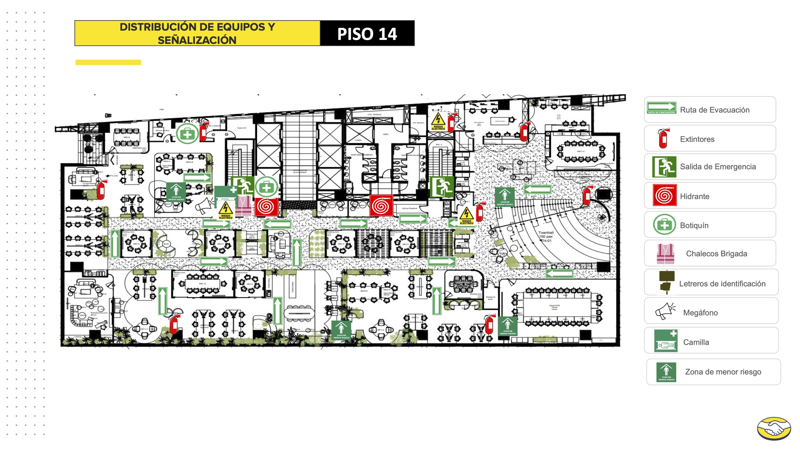
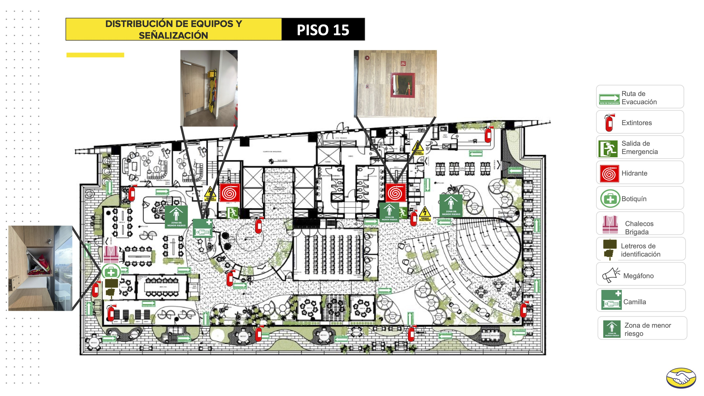

<!--
Copia del deck maestro (../protocolo-de-bienvenida.md) para la EDICIÓN 04
(viernes 16 de octubre de 2026, Town Hall de Mercado Libre).
Personalizadas: slide 7 (planos de emergencia) y slide 8 (host).
Las slides 1–6 no se editan aquí; si cambia la identidad, se actualiza el maestro.

Compilar desde la raíz del repo:
  npx @marp-team/marp-cli@latest 04-october-meetup/protocolo-de-bienvenida.md \
    --theme-set theme/uniconhub.css --pdf --allow-local-files
-->

# UniconHub

## Build. Connect. Repeat.

### Bienvenid@s a la meetup

<!--
Guion: dar la bienvenida, presentarte, agradecer la asistencia.
"Aquí no vienes a mirar. Vienes a hacer que cosas pasen."
Duración objetivo: 30–45 s.
-->

---

# ¿Qué es UniconHub?

Una **generación conectándose**.

- **No** es un evento aislado
- **No** es un club elitista

Es una comunidad creada por jóvenes del sector tecnológico: gente con ideas, gente que ejecuta, gente que está en todos los niveles.

<!--
Guion: UniconHub no es "de alguien", es de la comunidad. No importan los
títulos ni los años de experiencia — importa la curiosidad y las ganas de
crecer juntos. Ambiente libre de egos.
-->

---

# Origen

Hecho en **México · Colombia · Argentina**.

> Soñamos con ser la chispa del **Silicon Valley latinoamericano**.

<!--
Guion: comunidad multinacional desde el día uno. La meetup es una de varias
iniciativas; hoy vas a ver a la comunidad en acción.
-->

---

# Nuestra energía

- 📈 **Mentalidad de crecimiento**
- 🤝 **Networking sin incomodidad**
- 💡 **Ideas que se comparten**
- 🚀 **Personas que construyen en serio**

<!--
Guion: estos cuatro valores son el filtro de todo lo que hacemos. Si algo no
suma a uno de ellos, no va.
-->

---

# Iniciativas

| | |
|---|---|
| **Meetups** | encuentros presenciales como este |
| **Social Run** | 5 km + desayuno de networking, último sábado de cada mes |
| **Podcast** | historias reales de la comunidad |
| **Projects** | open source de la comunidad, cada uno un repo público |
| **Blog** | artículos por invitación, con revisión |
| **Voces** | lo que normalmente no se dice |

<!--
Guion: mencionar que vienen en camino un círculo de lectura tech y un
hackathon comunitario. Invitar a seguir @unicon.hub para fechas.
-->

---

# Protocolo de emergencia

> Tu seguridad es muy importante para UniconHub por eso te pedimos que ante una emergencia sigamos las siguientes instrucciones:
> - Intentemos mantener la calma en todo momento.
> - Durante la emergencia nos moveremos a la zona de seguridad más cercana.
> - No abandonaremos el lugar hasta que tengamos confirmación de qué es seguro desalojar.

---

# Planos de emergencia — Piso 14

<!-- Distribución de equipos y señalización del piso 14 (edificio Melitlan, Mercado Libre): ruta de evacuación, salidas, extintores, zona de menor riesgo. -->

---

# Planos de emergencia — Piso 15

<!-- Distribución de equipos y señalización del piso 15, donde está el Town Hall. -->

<!-- CONFIRMAR con Mercado Libre en qué piso está el Town Hall y ajustar el orden si aplica. -->

---

# Gracias a nuestro host

Esta edición es posible gracias a **Mercado Libre**,
que nos abre su Town Hall para hacer comunidad.

**¡Gracias por el espacio!** 🙌
